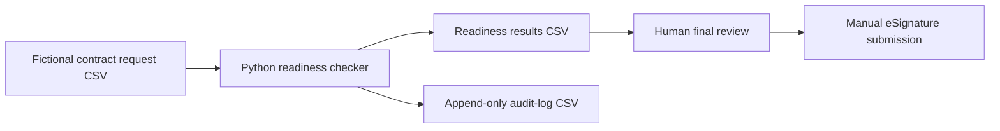

# Architecture

## Overview

This project is a local, CSV-based Python workflow prototype.

It validates fictional contract requests before human final review and manual submission to an eSignature platform.

## Components

| Component | Location | Responsibility |
|---|---|---|
| Sample input | `data/contract_requests_sample.csv` | Stores fictional contract-request records for validation. |
| Validation logic | `src/readiness_checker.py` | Reads CSV data, validates required fields and approval rules, assigns readiness status, and handles basic errors. |
| Current results | `output/readiness_results.csv` | Stores the latest readiness result for every input record. This file is replaced on each run. |
| Audit log | `output/audit_log.csv` | Stores one append-only audit event for every checked record. |
| Documentation | `README.md` and `docs/` | Explains the business process, rules, tests, limitations, and architecture. |

## Data Flow

1. A business user prepares fictional contract-request data in the input CSV.

2. The Python readiness checker reads all records and identifies duplicate contract IDs.

3. The checker applies data-quality and approval rules to each record.

4. The checker writes the latest results to `readiness_results.csv`.

5. The checker appends an audit event to `audit_log.csv` for every checked record.

6. A human reviews every result before any manual eSignature submission.

## Design Decisions

- Python standard-library modules keep the MVP lightweight and easy to run.
- CSV files provide a simple, inspectable input and output format.
- Data-quality issues take priority over missing-approval issues.
- Every request requires human final review.
- The audit log records checker activity only. It does not prove that a contract was submitted, approved, signed, cancelled, or executed.

## MVP Boundaries

This architecture does not include a database, authentication, cloud deployment, APIs, real eSignature integration, or automated submission.

These capabilities may be considered in a future phase only after appropriate business, security, and governance requirements are defined.