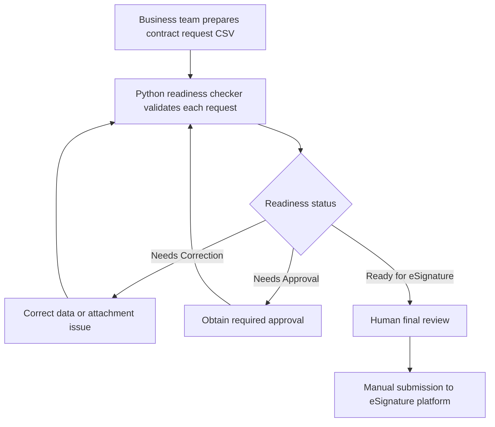

# Business Process

## Purpose

This document describes the fictional pre-signature readiness process used by this portfolio prototype.

The process helps a business team identify incomplete contract requests before human final review and manual submission to an eSignature platform.

## Process Flow



## Process Steps

1. The business team prepares a contract request with required information, approvals, and attachments.

2. The team adds the request to the fictional input CSV file.

3. The readiness checker validates the request data, approval requirements, and duplicate contract IDs.

4. The checker creates a readiness status and clear validation reasons.

5. The checker creates the latest results CSV and appends an audit event for each checked request.

6. If a request has `Needs Correction`, the business team corrects the data or attachment issue and runs the checker again.

7. If a request has `Needs Approval`, the business team obtains the required approval and runs the checker again.

8. If a request is `Ready for eSignature`, a human performs final review and manually submits the request to the eSignature platform.

## Human Review Safeguard

Every result includes:

```text
review_required = Yes
```

The checker does not approve, sign, or send a contract. It supports human decision-making by identifying readiness issues before manual submission.

## Process Boundaries

This prototype starts with a fictional CSV contract request and ends with a human final review decision.

Actual eSignature submission, cancellation, resubmission, executed-contract storage, and post-signature workflow management are outside the scope of this MVP.